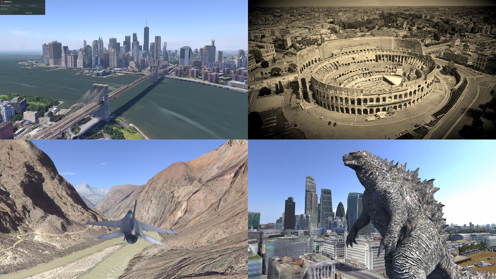

# Earthatile - 3D Maps for your Apps 🌎

Earthatile is an engine-agnostic runtime for loading and navigating [3D Tiles](https://github.com/CesiumGS/3d-tiles/tree/main#readme) geospatial datasets. Use it to [create immersive 3D map experiences with Photorealistic 3D Tiles](https://cloud.google.com/blog/products/maps-platform/create-immersive-3d-map-experiences-photorealistic-3d-tiles) such as flight simulators, explainers, games and more.

## Getting Started

Earthatile depends upon [Google's Photorealistic 3D Tiles API](https://developers.google.com/maps/documentation/tile/3d-tiles). To access it, you need an API key. You can obtain a key by setting up a Google Cloud project with a billing account. You then need to enable the Map Tiles API. To learn more, see [Setup in Cloud Console](https://developers.google.com/maps/documentation/tile/cloud-setup). Once you have your API key, you can:

### Node.js

If you want to run Earthatile in Node, you simply need to add it as a dependency in your `package.json`:

    npm install earthatile

### PlayCanvas

Earthatile is supplied with an integration for [PlayCanvas](https://playcanvas.com).

1. Copy `dist/earthatile.js` to the Asset Panel in the Editor.
2. Copy `integrations/playcanvas/*.js` to the Asset Panel in the Editor.
3. Create an Entity and add a Script Component.
4. Assign `tileRenderer` and `geolocation` scripts to the Script Component.
5. Add a Script Component to your Camera entity.
6. Assign the `flyCamera` script to the Script Component.
7. Launch the scene. 🚀

Alternatively, [fork this project](https://playcanvas.com/project/1074797/overview/earthatile-world-explorer).
